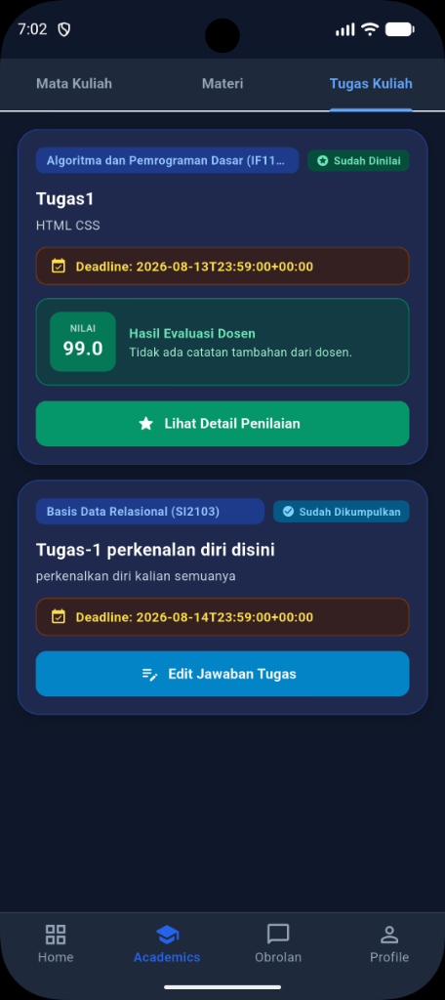
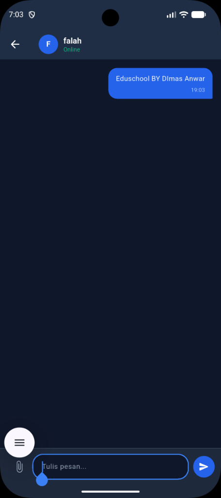
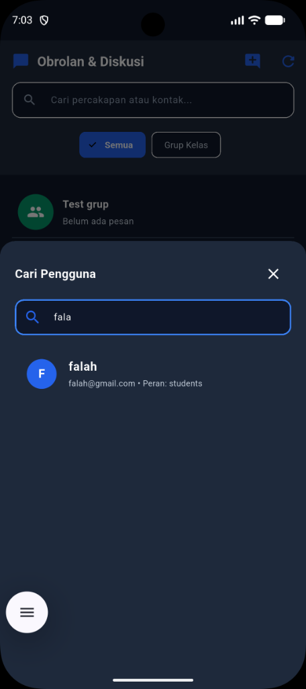
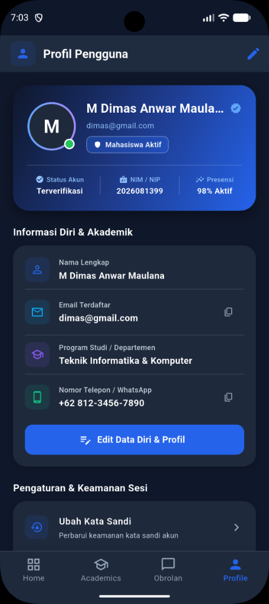

# EduSchool — Smart Learning Management System

EduSchool adalah sistem manajemen akademik berbasis Flutter dan Supabase yang menghubungkan mahasiswa, dosen, orang tua, dan administrator dalam satu ekosistem terpadu. Platform ini dirancang dengan arsitektur berbasis peran, komunikasi realtime, serta keamanan data tingkat lanjut.

---

## Tampilan Aplikasi

| Tugas & Evaluasi | Obrolan Realtime | Pencarian Pengguna | Profil Pengguna |
|---|---|---|---|
|  |  |  |  |

---

## Fitur Utama

### Portal Mahasiswa
* Akses daftar mata kuliah terdaftar, rekapitulasi progres akademik, dan nilai evaluasi.
* Unduh berkas materi perkuliahan dalam berbagai format dokumen.
* Kirim pengajuan tugas multiline beserta penambahan tautan berkas terproteksi.
* Pantau umpan balik evaluasi dan catatan dari dosen pengampu secara transparan.

### Portal Dosen
* Kelola mata kuliah, buat modul materi, serta unggah berkas pembelajaran pendukung.
* Buat tugas baru lengkap dengan instruksi, bobot penilaian, dan tenggat waktu submission.
* Evaluasi jawaban mahasiswa, berikan nilai 0 hingga 100, serta masukkan catatan perbaikan.

### Portal Orang Tua
* Pantau perkembangan belajar, tingkat kehadiran, dan rekapitulasi pencapaian akademik anak.
* Akses pengumuman resmi instansi dan fasilitasi komunikasi dengan pihak pengajar.

### Portal Administrator
* Kelola kurikulum, tambah mata kuliah baru, tentukan bobot SKS, semester, dan tetapkan dosen pengampu.
* Kelola pendaftaran mahasiswa ke dalam mata kuliah secara spesifik maupun massal.
* Buat dan siarkan pengumuman resmi kategori reguler maupun darurat secara realtime.

### Obrolan & Layanan Pesan Realtime
* Fasilitas pesan instan antar pengguna terautentikasi (Mahasiswa, Dosen, dan Orang Tua).
* Pembaruan data instan yang ditenagai oleh Supabase Realtime Channels.

### Keamanan & Pengalaman Pengguna
* Mesin tema adaptif dengan dukungan penuh Dark Mode dan Light Mode pada seluruh modul.
* Proteksi skema URL terverifikasi, validasi format email regex, serta enkripsi sesi autentikasi.

---

## Teknologi yang Digunakan

* Frontend: Flutter (Dart 3.x)
* Desain UI: Material Design 3, Glassmorphism, Responsive Adaptive Layout
* Backend & Database: Supabase (PostgreSQL, Realtime Subscriptions, Row Level Security)
* Autentikasi: Supabase Auth dengan penanganan metadata Custom Claims
* Manajemen State: ValueNotifier dan StatefulWidget modular
* Penyimpanan & Lingkungan: flutter_dotenv, shared_preferences

---

## Skema Database & DDL SQL

Struktur tabel PostgreSQL pada Supabase dirancang sebagai berikut:

```sql
-- 1. TABEL PROFILES (Ekstensi data pengguna auth.users)
CREATE TABLE public.profiles (
    id UUID PRIMARY KEY REFERENCES auth.users(id) ON DELETE CASCADE,
    full_name TEXT NOT NULL,
    email TEXT UNIQUE NOT NULL,
    role TEXT NOT NULL CHECK (role IN ('student', 'students', 'teacher', 'teachers', 'parent', 'parents', 'admin')),
    nim TEXT,
    jurusan TEXT,
    avatar_url TEXT,
    created_at TIMESTAMPTZ DEFAULT NOW()
);

-- Trigger Otomatis: Membuat baris profil saat pengguna mendaftar di auth.users
CREATE OR REPLACE FUNCTION public.handle_new_user()
RETURNS TRIGGER AS $$
BEGIN
    INSERT INTO public.profiles (id, full_name, email, role, nim, jurusan)
    VALUES (
        NEW.id,
        COALESCE(NEW.raw_user_meta_data->>'full_name', 'Pengguna Baru'),
        NEW.email,
        COALESCE(NEW.raw_user_meta_data->>'role', 'student'),
        NEW.raw_user_meta_data->>'nim',
        NEW.raw_user_meta_data->>'jurusan'
    );
    RETURN NEW;
END;
$$ LANGUAGE plpgsql SECURITY DEFINER;

CREATE OR REPLACE TRIGGER on_auth_user_created
    AFTER INSERT ON auth.users
    FOR EACH ROW EXECUTE FUNCTION public.handle_new_user();

-- 2. TABEL MATA KULIAH
CREATE TABLE public.mata_kuliah (
    id UUID PRIMARY KEY DEFAULT gen_random_uuid(),
    kode_mk TEXT UNIQUE NOT NULL,
    nama_mk TEXT NOT NULL,
    sks INT NOT NULL DEFAULT 3,
    semester INT NOT NULL DEFAULT 1,
    dosen_id UUID REFERENCES public.profiles(id) ON DELETE SET NULL,
    created_at TIMESTAMPTZ DEFAULT NOW()
);

-- 3. TABEL ENROLLMENTS (Hubungan Mahasiswa & Mata Kuliah)
CREATE TABLE public.enrollments (
    id UUID PRIMARY KEY DEFAULT gen_random_uuid(),
    course_id UUID NOT NULL REFERENCES public.mata_kuliah(id) ON DELETE CASCADE,
    student_id UUID NOT NULL REFERENCES public.profiles(id) ON DELETE CASCADE,
    created_at TIMESTAMPTZ DEFAULT NOW(),
    UNIQUE(course_id, student_id)
);

-- 4. TABEL MATERI PERKULIAHAN
CREATE TABLE public.materi (
    id UUID PRIMARY KEY DEFAULT gen_random_uuid(),
    course_id UUID NOT NULL REFERENCES public.mata_kuliah(id) ON DELETE CASCADE,
    judul TEXT NOT NULL,
    deskripsi TEXT,
    file_url TEXT,
    teacher_id UUID REFERENCES public.profiles(id) ON DELETE SET NULL,
    created_at TIMESTAMPTZ DEFAULT NOW()
);

-- 5. TABEL TUGAS PERKULIAHAN
CREATE TABLE public.tugas (
    id UUID PRIMARY KEY DEFAULT gen_random_uuid(),
    course_id UUID NOT NULL REFERENCES public.mata_kuliah(id) ON DELETE CASCADE,
    judul TEXT NOT NULL,
    deskripsi TEXT,
    deadline TEXT NOT NULL,
    deadline_date_time TIMESTAMPTZ,
    teacher_id UUID REFERENCES public.profiles(id) ON DELETE SET NULL,
    created_at TIMESTAMPTZ DEFAULT NOW()
);

-- 6. TABEL PENGAJUAN TUGAS (SUBMISSIONS)
CREATE TABLE public.pengajuan_tugas (
    id UUID PRIMARY KEY DEFAULT gen_random_uuid(),
    tugas_id UUID NOT NULL REFERENCES public.tugas(id) ON DELETE CASCADE,
    student_id UUID NOT NULL REFERENCES public.profiles(id) ON DELETE CASCADE,
    jawaban TEXT NOT NULL,
    file_url TEXT,
    nilai INT CHECK (nilai >= 0 AND nilai <= 100),
    catatan_dosen TEXT,
    status TEXT DEFAULT 'submitted' CHECK (status IN ('submitted', 'graded')),
    submitted_at TIMESTAMPTZ DEFAULT NOW(),
    UNIQUE(tugas_id, student_id)
);

-- 7. TABEL PENGUMUMAN
CREATE TABLE public.pengumuman (
    id UUID PRIMARY KEY DEFAULT gen_random_uuid(),
    judul TEXT NOT NULL,
    isi TEXT NOT NULL,
    is_urgent BOOLEAN DEFAULT FALSE,
    created_at TIMESTAMPTZ DEFAULT NOW()
);

-- 8. TABEL CHAT ROOMS & MESSAGES
CREATE TABLE public.chat_rooms (
    id UUID PRIMARY KEY DEFAULT gen_random_uuid(),
    created_at TIMESTAMPTZ DEFAULT NOW()
);

CREATE TABLE public.chat_participants (
    id UUID PRIMARY KEY DEFAULT gen_random_uuid(),
    room_id UUID NOT NULL REFERENCES public.chat_rooms(id) ON DELETE CASCADE,
    user_id UUID NOT NULL REFERENCES public.profiles(id) ON DELETE CASCADE,
    UNIQUE(room_id, user_id)
);

CREATE TABLE public.chat_messages (
    id UUID PRIMARY KEY DEFAULT gen_random_uuid(),
    room_id UUID NOT NULL REFERENCES public.chat_rooms(id) ON DELETE CASCADE,
    sender_id UUID NOT NULL REFERENCES public.profiles(id) ON DELETE CASCADE,
    message_text TEXT NOT NULL,
    created_at TIMESTAMPTZ DEFAULT NOW()
);
```

---

## Kebijakan Keamanan Data (Row Level Security - RLS)

Implementasi isolasi data dan kontrol akses berbasis peran menggunakan skrip berikut:

```sql
-- Aktifkan RLS pada seluruh tabel
ALTER TABLE public.profiles ENABLE ROW LEVEL SECURITY;
ALTER TABLE public.mata_kuliah ENABLE ROW LEVEL SECURITY;
ALTER TABLE public.enrollments ENABLE ROW LEVEL SECURITY;
ALTER TABLE public.materi ENABLE ROW LEVEL SECURITY;
ALTER TABLE public.tugas ENABLE ROW LEVEL SECURITY;
ALTER TABLE public.pengajuan_tugas ENABLE ROW LEVEL SECURITY;
ALTER TABLE public.pengumuman ENABLE ROW LEVEL SECURITY;
ALTER TABLE public.chat_rooms ENABLE ROW LEVEL SECURITY;
ALTER TABLE public.chat_participants ENABLE ROW LEVEL SECURITY;
ALTER TABLE public.chat_messages ENABLE ROW LEVEL SECURITY;

-- Profiles Policies
CREATE POLICY "Public profiles reading" ON public.profiles
    FOR SELECT TO authenticated USING (true);

CREATE POLICY "Users update own profile" ON public.profiles
    FOR UPDATE TO authenticated USING (auth.uid() = id);

-- Mata Kuliah Policies
CREATE POLICY "Authenticated read mata_kuliah" ON public.mata_kuliah
    FOR SELECT TO authenticated USING (true);

CREATE POLICY "Admin & Teacher insert mata_kuliah" ON public.mata_kuliah
    FOR INSERT TO authenticated WITH CHECK (true);

CREATE POLICY "Admin & Teacher update mata_kuliah" ON public.mata_kuliah
    FOR UPDATE TO authenticated USING (true);

CREATE POLICY "Admin delete mata_kuliah" ON public.mata_kuliah
    FOR DELETE TO authenticated USING (true);

-- Materi & Tugas Policies
CREATE POLICY "Read materi" ON public.materi
    FOR SELECT TO authenticated USING (true);

CREATE POLICY "Manage materi by teacher" ON public.materi
    FOR ALL TO authenticated USING (true);

CREATE POLICY "Read tugas" ON public.tugas
    FOR SELECT TO authenticated USING (true);

CREATE POLICY "Manage tugas by teacher" ON public.tugas
    FOR ALL TO authenticated USING (true);

-- Pengajuan Tugas Policies
CREATE POLICY "Student read own submissions" ON public.pengajuan_tugas
    FOR SELECT TO authenticated USING (
        auth.uid() = student_id OR EXISTS (
            SELECT 1 FROM public.tugas t WHERE t.id = pengajuan_tugas.tugas_id AND t.teacher_id = auth.uid()
        )
    );

CREATE POLICY "Student insert own submission" ON public.pengajuan_tugas
    FOR INSERT TO authenticated WITH CHECK (auth.uid() = student_id);

CREATE POLICY "Student update own submission" ON public.pengajuan_tugas
    FOR UPDATE TO authenticated USING (
        auth.uid() = student_id OR EXISTS (
            SELECT 1 FROM public.tugas t WHERE t.id = pengajuan_tugas.tugas_id AND t.teacher_id = auth.uid()
        )
    );

-- Chat & Messaging Policies
CREATE POLICY "Participants access room" ON public.chat_rooms
    FOR SELECT TO authenticated USING (
        EXISTS (SELECT 1 FROM public.chat_participants cp WHERE cp.room_id = chat_rooms.id AND cp.user_id = auth.uid())
    );

CREATE POLICY "Read chat_messages" ON public.chat_messages
    FOR SELECT TO authenticated USING (
        EXISTS (SELECT 1 FROM public.chat_participants cp WHERE cp.room_id = chat_messages.room_id AND cp.user_id = auth.uid())
    );

CREATE POLICY "Insert chat_messages" ON public.chat_messages
    FOR INSERT TO authenticated WITH CHECK (
        auth.uid() = sender_id AND EXISTS (
            SELECT 1 FROM public.chat_participants cp WHERE cp.room_id = chat_messages.room_id AND cp.user_id = auth.uid()
        )
    );
```

---

## Petunjuk Instalasi & Pengoperasian

### Prasyarat
* Flutter SDK versi 3.12.2 atau lebih baru
* Dart SDK versi 3.0.0 atau lebih baru
* Proyek Supabase aktif

### Konfigurasi Berkas Lingkungan (.env)
Buat berkas `.env` pada direktori utama proyek dengan konfigurasi sebagai berikut:

```env
SUPABASE_URL=https://your-project-id.supabase.co
PUBLISHABLE_KEY=your-supabase-publishable-anon-key
```

### Memulai Aplikasi
```bash
# 1. Unduh seluruh dependensi proyek
flutter pub get

# 2. Jalankan pemeriksaan kualitas kode
flutter analyze

# 3. Jalankan aplikasi pada lingkungan pengembangan
flutter run
```

---

Hak Cipta © 2026 EduSchool Team. Seluruh Hak Dilindungi.
